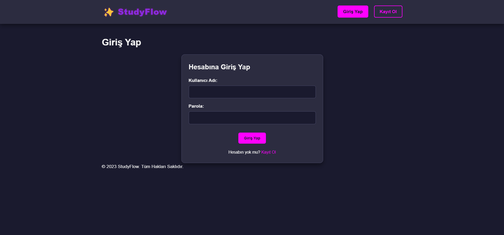
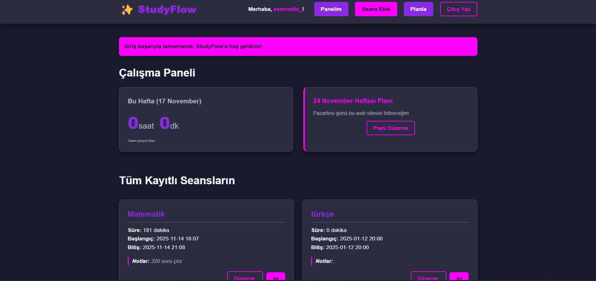

# 🐍 StudyFlow: Basit Eğitim Takip Uygulaması

> **Python** ile geliştirilmiş, öğrenci veya eğitmenlerin ders takibini kolaylaştıran, sade ve işlevsel bir uygulamadır.

---

## 🖥️ Proje Görünümleri

StudyFlow uygulamasının temel ekranları aşağıdadır:

### 1. Giriş Sayfası

Kullanıcıların sisteme ilk girdiği ve yetkilendirme yaptığı ekran.



### 2. Ana Panel (Dashboard)

Giriş yapıldıktan sonra kullanıcıyı karşılayan ve genel durumu gösteren ana ekran.



### 3. Ek Özellik Görünümü

Uygulamanın ana fonksiyonlarından birini gösteren üçüncü ekran.


---

## ✨ Temel Özellikler

* **Takip:** Ders saatleri ve önemli tarihlerin takibi.
* **Organizasyon:** Ödevleri ve notları düzenleme.
* **Kolay Kullanım:** Sade ve karmaşık olmayan arayüz.

---

## 🛠️ Kurulum ve Çalıştırma

Projeyi yerel makinenizde çalıştırmak için aşağıdaki adımları takip edin:

### Gereksinimler

* **Python** (3.x önerilir)
* **pip** (Python paket yöneticisi)
* Git

### Adımlar

1.  **Projeyi Klonlayın:**
    Öncelikle projeyi yerel makinenize indirin:
    ```bash
    git clone [https://github.com/atlasesmanur-ux/StudyFlow.git](https://github.com/atlasesmanur-ux/StudyFlow.git)
    cd StudyFlow
    ```

2.  **Bağımlılıkları Yükleyin:**
    Projenizdeki gerekli tüm Python kütüphanelerini yükleyin.
    *(Eğer projeniz için bir **requirements.txt** dosyanız varsa, bu komutu kullanın:)*
    ```bash
    pip install -r requirements.txt
    ```
    *(Eğer bu dosyanız yoksa, projenizin kullandığı kütüphaneleri (örneğin Flask, Django, Pandas vb.) tek tek yükleyin: `pip install flask`)*

3.  **Uygulamayı Başlatın:**
    Projenizin ana çalıştırma dosyasını çalıştırın:
    ```bash
    python app.py
    ```
    *(**Not:** Ana dosyanızın adı `app.py` değilse, lütfen bu kısmı `python <ana_dosya_adınız>.py` şeklinde değiştirin.)*

---

    git push
    ```
Bu, projenizi GitHub'da sergilemek için en doğru ve sade yöntemdir.
