#  StudyFlow

StudyFlow, bireysel çalışma süreçlerini dijitalleştiren, performans takibi sağlayan ve görev yönetimini optimize eden web tabanlı bir uygulamadır.

Bu proje, klasik yapılacaklar listesi mantığını Kanban metodolojisi ve Pomodoro zaman yönetimi tekniği ile birleştirerek tek bir platformda sunmaktadır.

## Kullanılan Teknolojiler

Bu proje **Python** ve **Flask** altyapısı kullanılarak geliştirilmiştir. Veritabanı yönetimi için **MySQL**, arayüz tasarımı ve etkileşimler için ise **HTML, CSS ve JavaScript** teknolojileri kullanılmıştır.

## Kurulum

Projeyi kendi bilgisayarınızda çalıştırmak için aşağıdaki adımları izleyebilirsiniz:

1.  **Projeyi indirin:**
    `git clone https://github.com/atlasesmanur-ux/studyflow.git`
2.  **Gerekli kütüphaneleri yükleyin:**
    `pip install -r requirements.txt`
3.  **Veritabanı ayarlarını yapın:**
    `config.py` dosyasındaki veritabanı bağlantı bilgilerini kendi sisteminize göre düzenleyin.
4.  **Uygulamayı çalıştırın:**
    `python app.py`

---

## Proje Arayüzü ve Modüller

Uygulama temel olarak 5 ana bölümden oluşmaktadır.

### 1. Giriş Ekranı
Kullanıcıların sisteme güvenli bir şekilde erişim sağladığı karşılama ekranıdır.

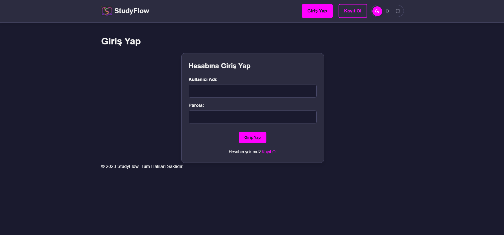

### 2. Yönetim Paneli (Dashboard)
Kullanıcının genel durumunu özetleyen ana sayfadır. Ders bazlı çalışma süreleri grafiklerle gösterilir, haftalık hedeflere ulaşma durumu yüzdesel olarak sunulur ve son eklenen çalışmalar listelenir.

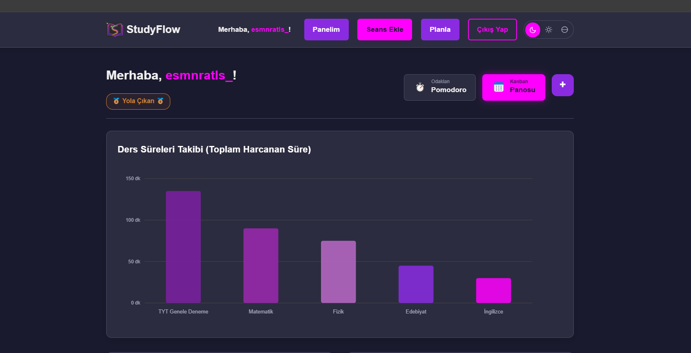
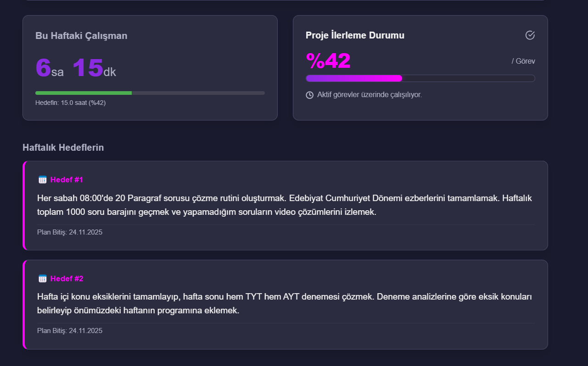
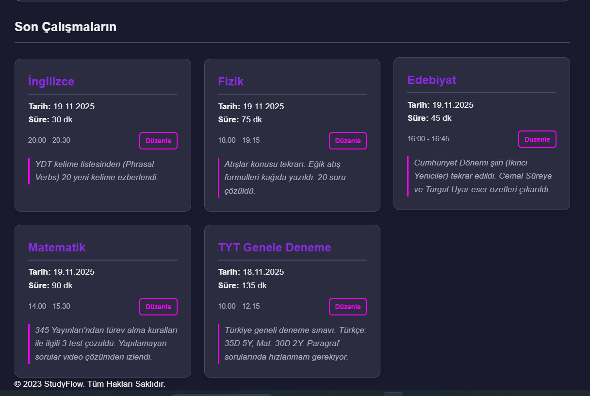

### 3. Veri Girişi ve Planlama
Kullanıcının yaptığı çalışmaları manuel olarak sisteme girdiği ve gelecek hafta için hedeflerini belirlediği bölümdür.

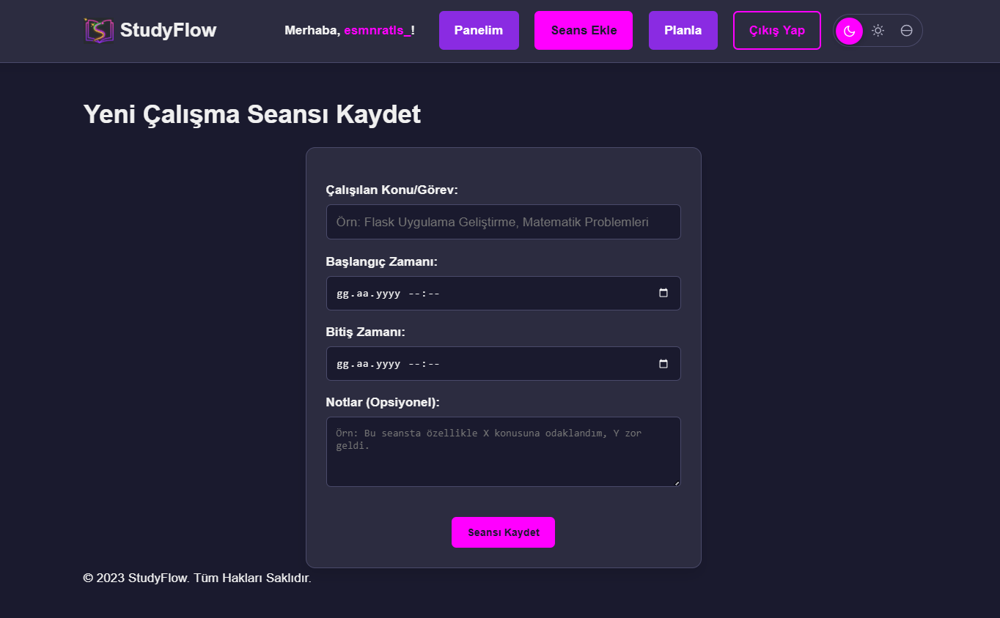
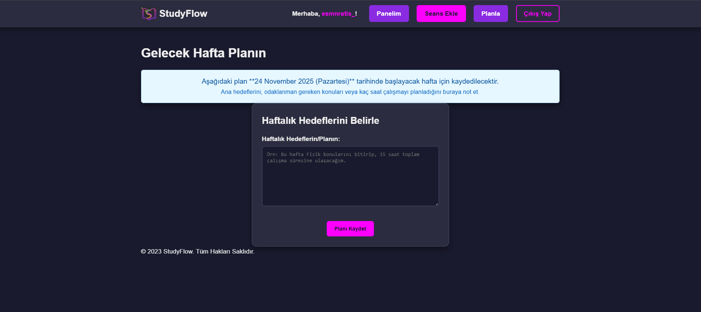

### 4. Kanban Görev Yönetimi
Görevlerin durumlarını görselleştirmek için kullanılan panodur. İşler "Yapılacaklar", "Süreçte" ve "Tamamlandı" statüleri arasında sürüklenip bırakılabilir.

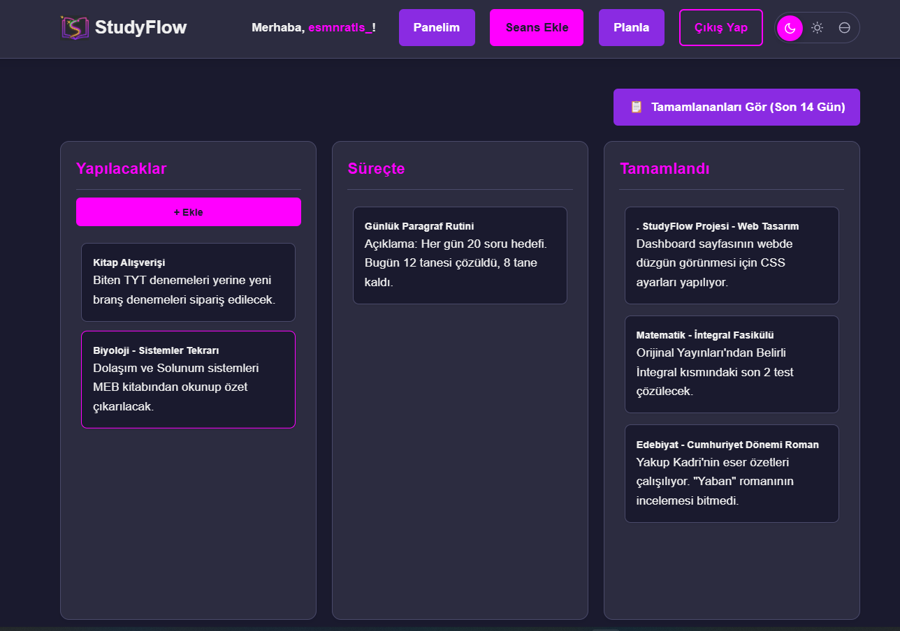
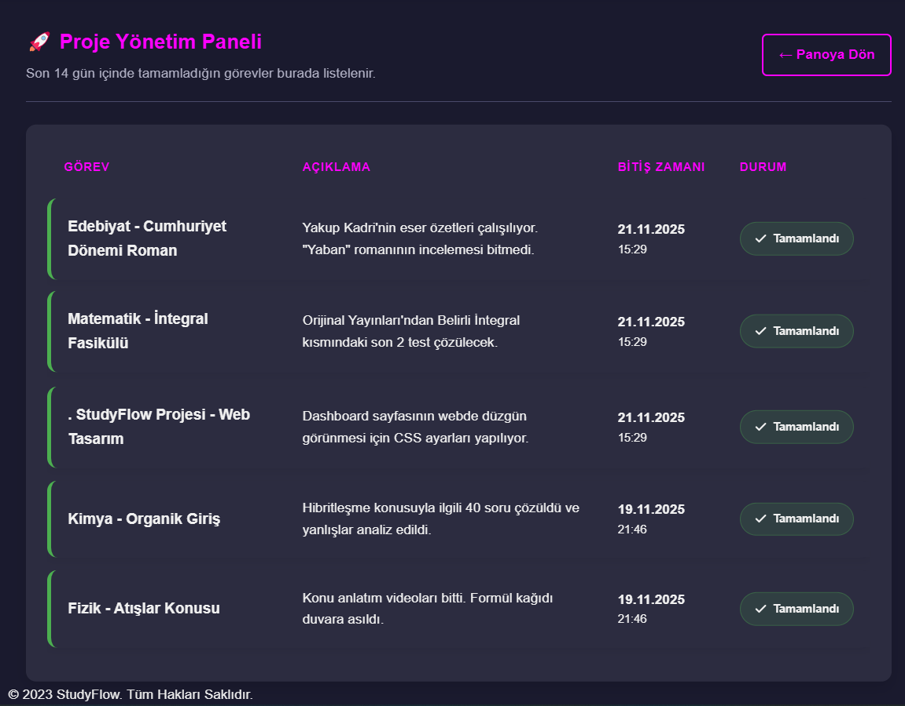

### 5. Pomodoro Odaklanma Aracı
Çalışma disiplinini sağlamak için geliştirilmiş zamanlayıcı modülüdür. Farklı çalışma ve mola süreleri seçilebilir.

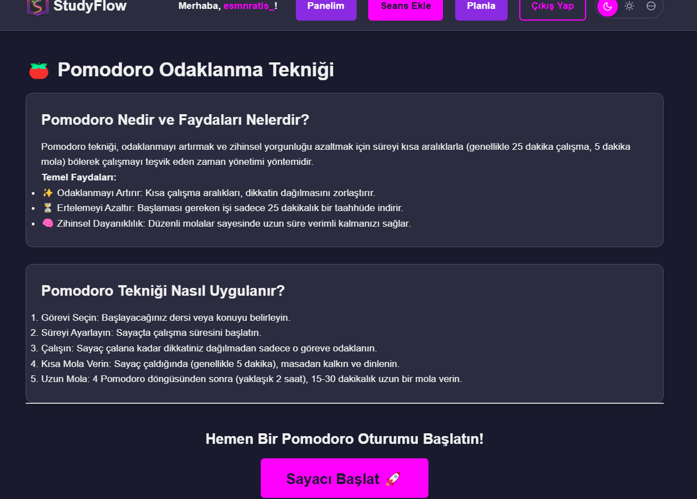
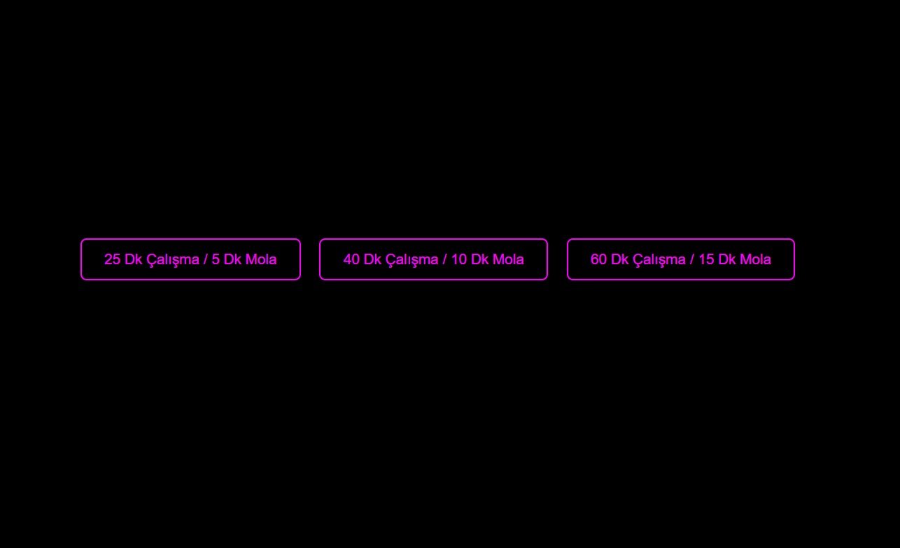

---

## Tema Seçenekleri

Uygulama, kullanıcı deneyimini geliştirmek adına farklı renk temalarını desteklemektedir. Varsayılan karanlık modun yanı sıra Aydınlık (Light) ve Okyanus (Ocean) temaları mevcuttur.

**Aydınlık Tema (Light Mode):**

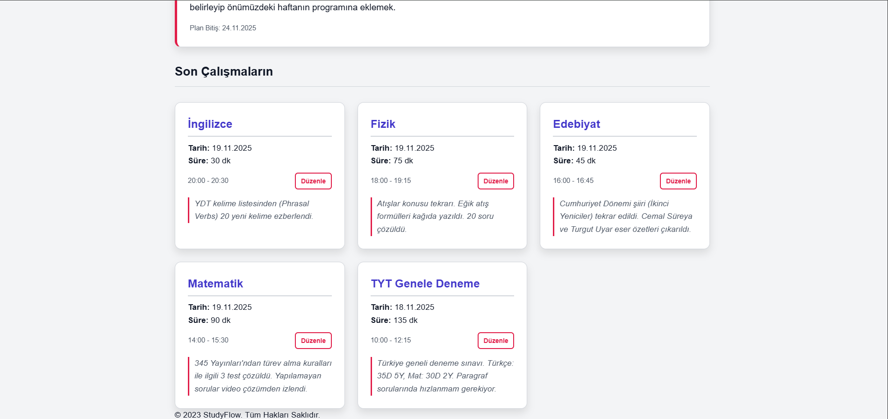

**Okyanus Teması (Ocean Mode):**
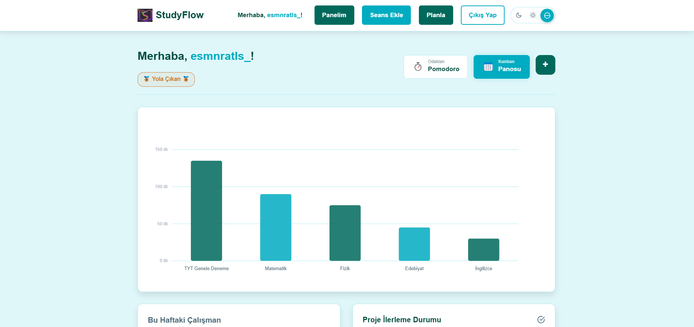
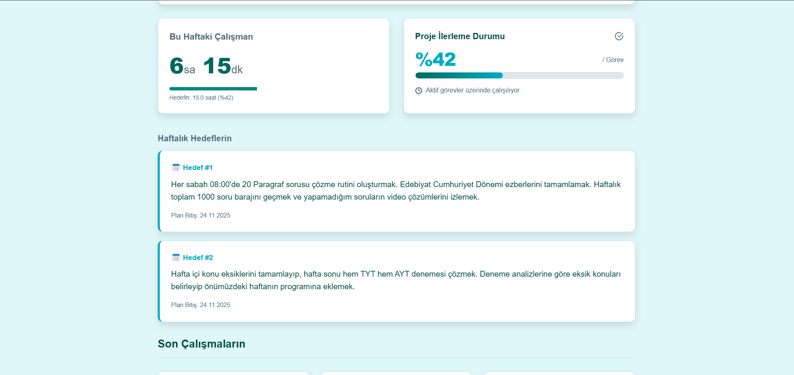

